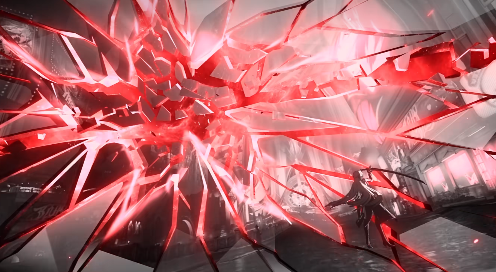
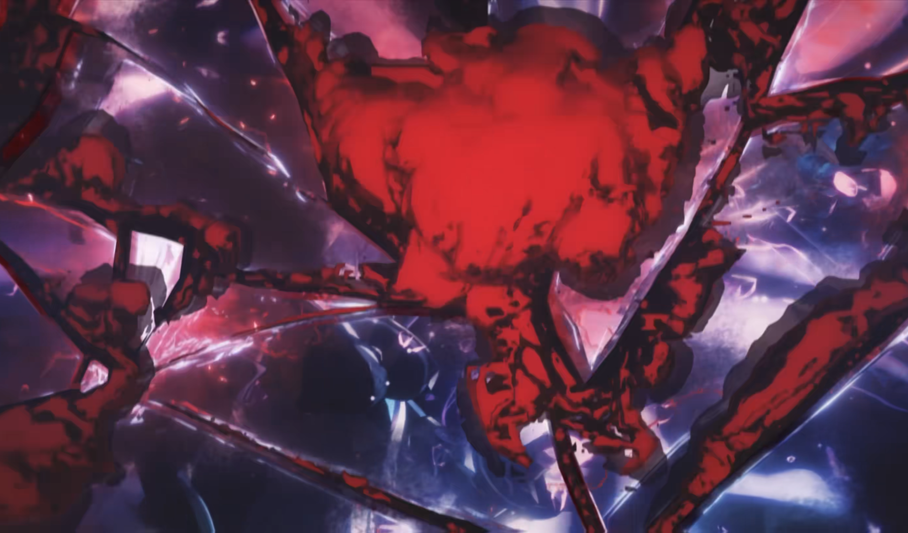
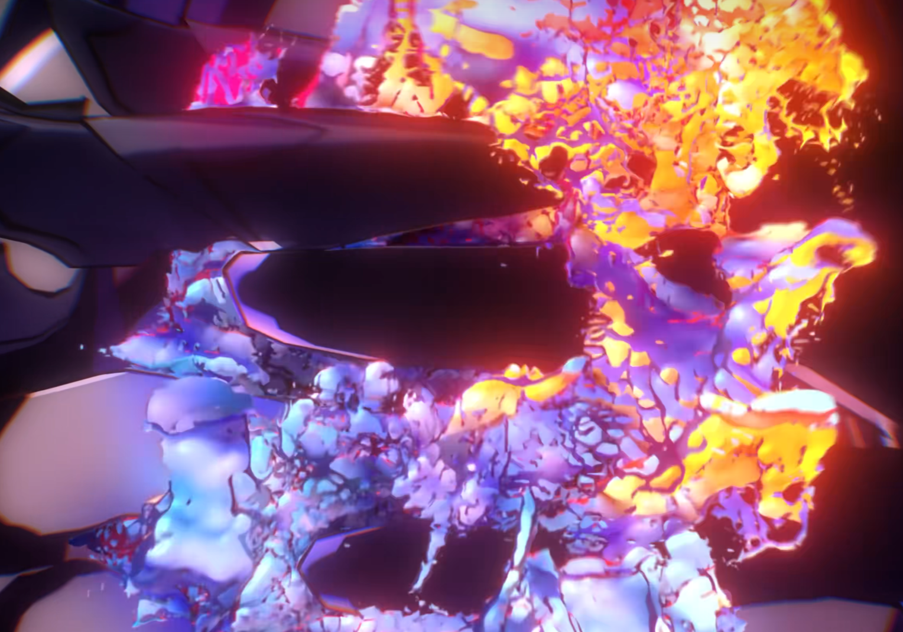
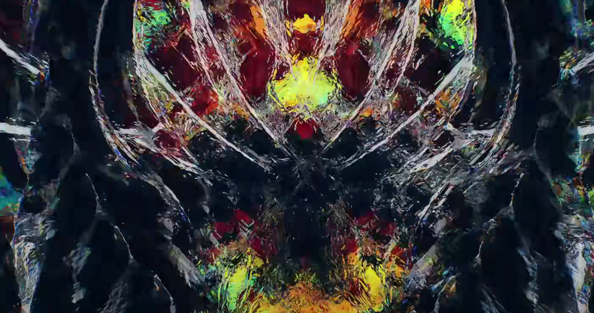
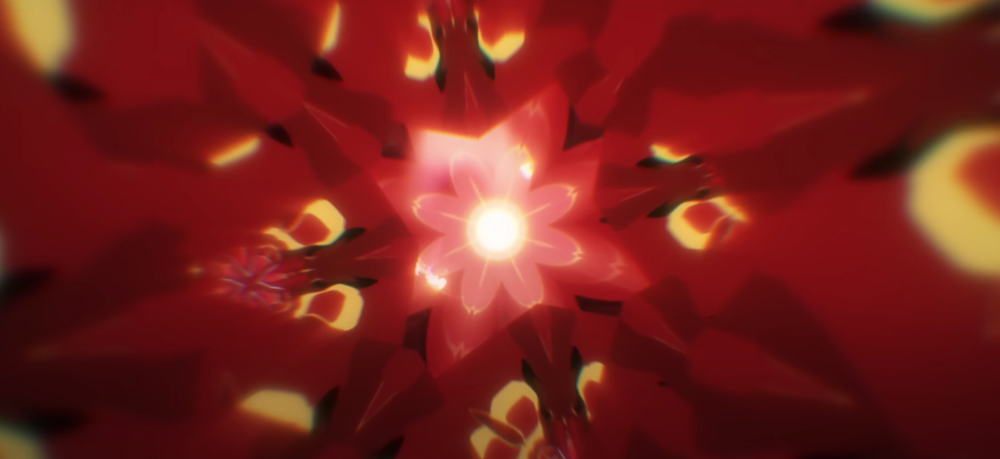

# yzha0808_9105_tut5

## part1：Imaging Technology Inspiration
"Honkai: Star Rail" Yoshizumi's character PV - "Your Color" gave me great creative inspiration.

[Link video](https://www.youtube.com/watch?v=IQQPDPAvxTg)
All images are from PV screenshots

- **Visual effect:** "In this PV, the method of breaking the screen (breaking the fourth wall) is used many times to give the viewer visual conflict. In this PV, by using fractal art to show the image of the character, it is not only For aesthetic effect and more importantly to convey the character's multifaceted nature and mystery.

- **ideas and concepts:** Each fractal pattern is a side of the character, and when these sides are combined together, they present a richer and more complex image that is consistent with the real-life character. , everyone has different angles and aspects, forming a multi-faceted whole.

I wanted to emulate this imaging technique and try to express the multifaceted nature of things in my work. I want to break the conventional narrative structure or use artistic techniques to show the diversity of objects or characters, so that the audience can have more thoughts and associations while watching the work.

## Part 2: Exploration of Coding Technology

For the implementation of the visual effects inspired by the color palette of the PV image, I will use FBM Feedback GLSL from the p5.js library.

- **How p5.js FBM Feedback GLSL Helps:** The FBM Feedback GLSL in p5.js allows for the creation of intricate and visually dynamic patterns. By leveraging this function, we can generate color gradients and textures that mimic the complexity and richness of the PV color palette. Adjusting parameters such as persistence, octaves, and scale enables us to fine-tune the appearance of the generated patterns to closely match the desired color scheme.

- **Example Implementation:** Below is an example link demonstrating the use of the vTexCoord function from the p5.js library to create color patterns inspired by the PV image:

[p5.js FBM Example](./assets/Example1.png)
[Link CODE](https://editor.p5js.org/marcelrodriguezricc/sketches/hD-cb0jsG)

In addition, we can also use p5.js's beginShape() and endShape() combined with the vertex() function to create the effect of broken fragments. Irregular shapes can be built by defining the vertices of polygons to create a broken feel.

[example shows image rotation](https://p5js.org/reference/#/p5/vertex)

vTexCoord can also help us create a cutting and shattering feeling.
[vTexCoord example shows image cutting and cracking feeling](./assets/Example2.png)
[Link CODE](https://editor.p5js.org/AndreaOguey/sketches/TBQBVh3Vh)

9